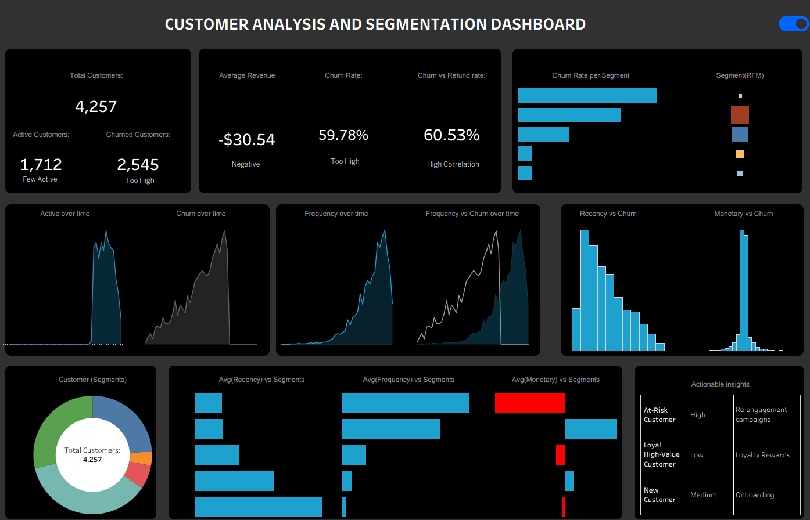

# Customer Churn Analysis and Segmentation

## Project Overview

This project analyzes customer behavior to identify churn drivers, segment customers, and provide actionable recommendations to improve retention and revenue.

## Objectives

* Identify key drivers of customer churn
* Segment customers based on behavior (RFM)
* Build a predictive model for churn
* Provide actionable business recommendations

---

## Dataset

The dataset contains customer transaction data, including:

* Customer ID
* Order Date and Signup Date
* Transaction Amount
* Refund Indicator

---

## Data Preparation

* Corrected inconsistencies between order and signup dates
* Standardized refund behavior using transaction values
* Engineered RFM features (Recency, Frequency, Monetary)
* Defined churn based on inactivity threshold

---

## Modeling

### Churn Prediction Model

**Model Used:** Logistic Regression

**Performance:**

* Precision: 72.53%
* Recall: 93.63%
* F1 Score: 81.74%
* Accuracy: 75.35%

---

### Customer Segmentation

**Method:** K-Means Clustering
**Optimal Clusters:** 5

**Segments:**

* Loyal High-Value Customers
* At-Risk Customers
* New Customers
* Discount-Seekers Customers
* Occassional Customers

---

## Key Insights

* Churn rate is high, indicating a significant retention challenge
* Customer inactivity is the strongest predictor of churn
* Higher purchase frequency reduces churn risk
* Refund behavior is strongly associated with churn
* High-spending customers are not necessarily retained
* A large portion of customers fall into at-risk segments

---

## Recommendations

* Re-engage at-risk customers with targeted campaigns
* Address refund-related issues to improve satisfaction
* Retain high-value customers through loyalty strategies
* Increase purchase frequency via personalized engagement
* Improve onboarding to drive repeat purchases

---

## Dashboard Features

* KPI tracking (churn rate, revenue, customer count)
* Trend analysis over time
* Churn driver visualization
* Customer segmentation analysis
* Integrated insights for decision-making

---

## Challenges

* Data inconsistencies required careful cleaning and validation
* Simulating realistic customer behavior introduced data integrity issues
* Initial models showed inflated performance due to data leakage
* Translating clusters into business segments required interpretation

---

## Tools and Technologies

* Python (Pandas, Scikit-learn)
* Machine Learning (Logistic Regression, K-Means)
* Data Visualization (Dashboard Development)

---

## Project Structure

```
/Customer-Segmentation and churn Prediction
│
├── README.md
├── customer-analysis.png
├── /data
├── /notebooks
└── /dashboard
```

---

## Project Workflow

* Data Cleaning
* Feature Engineering (RFM)
* Churn Modeling
* Customer Segmentation
* Dashboard Development
* Insights and Recommendations


---

## Dashboard Preview



---


